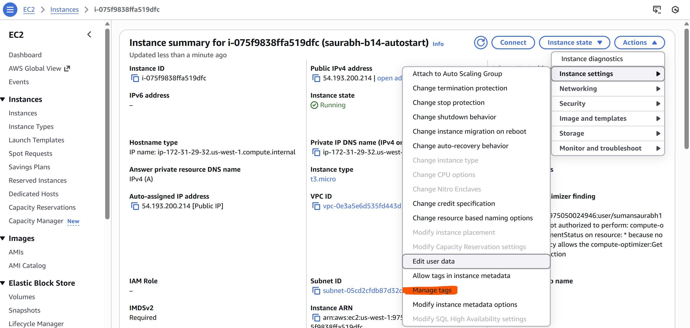
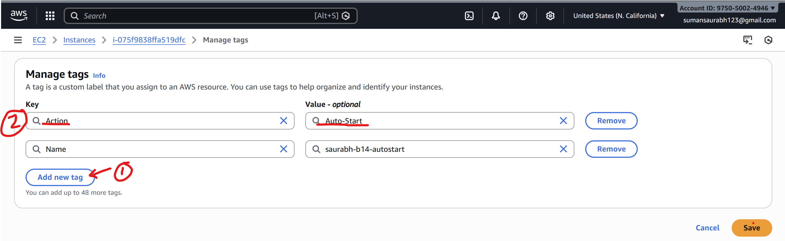
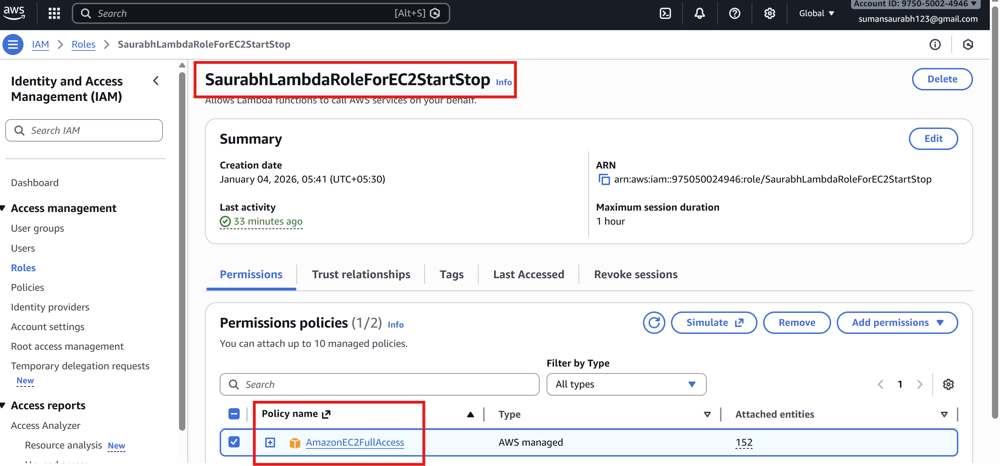
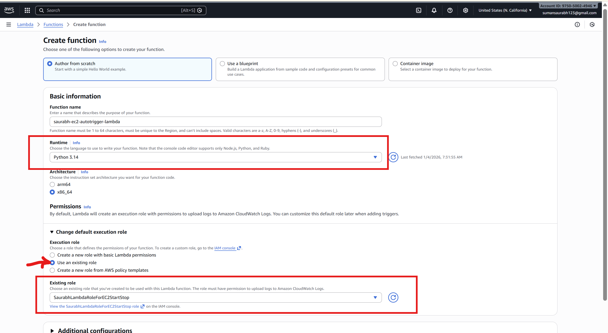
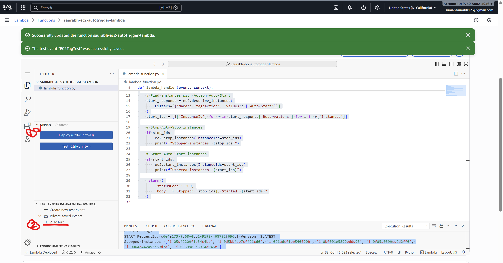
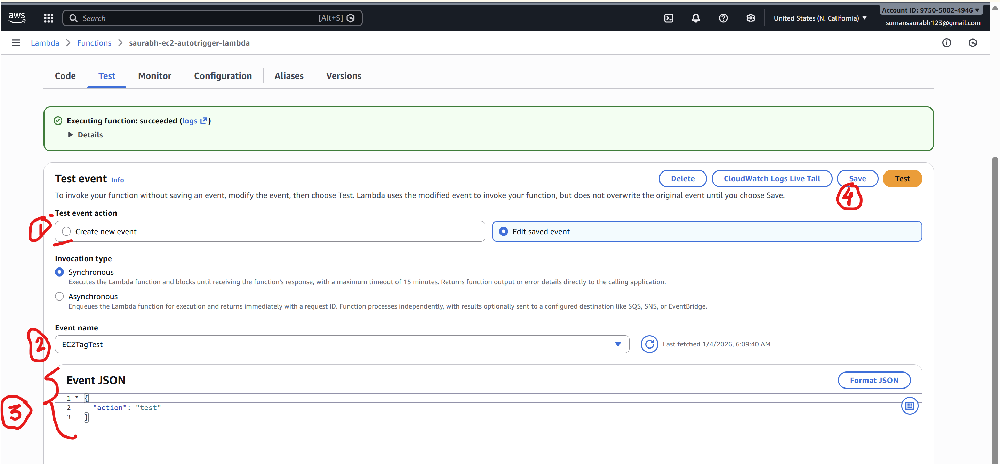
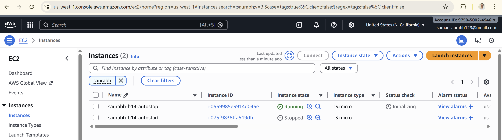

# Automated Instance Management Using AWS Lambda and Boto3

## 📌 Objective
This project demonstrates how to automate the management of Amazon EC2 instances using **AWS Lambda** and **Boto3** (Amazon's SDK for Python). The Lambda function automatically **stops** or **starts** EC2 instances based on their tags.

---

## 🛠️ Tasks Overview
1. **Setup EC2 Instances**
   - Create two EC2 instances (`t2.micro` or any free-tier type).
   - Tag one instance with `Action=Auto-Stop`.
   - Tag the other instance with `Action=Auto-Start`.

2. **Lambda Function Creation**
   - Create a Lambda function in AWS.
   - Assign an IAM role with permissions to manage EC2 instances.
   - Write Python code using **Boto3** to:
     - Stop instances tagged `Auto-Stop`.
     - Start instances tagged `Auto-Start`.

3. **Testing**
   - Manually invoke the Lambda function.
   - Verify that the instances change state according to their tags.

---

## ⚙️ Prerequisites
- AWS account with access to **EC2** and **Lambda**.
- IAM permissions to create roles and attach policies.
- Basic knowledge of Python and AWS services.

---

## 🚀 Step-by-Step Instructions

### 1. EC2 Setup
- Navigate to the **EC2 Dashboard**.
- Launch **two t2.micro instances** (free-tier eligible).
- Add tags:
  - Instance 1 → `Key: Action`, `Value: Auto-Stop`
  - Instance 2 → `Key: Action`, `Value: Auto-Start`
 




---

### 2. IAM Role for Lambda
- Go to the **IAM Dashboard**.
- Create a new role for **Lambda**.
- Attach the policy:  
  - `AmazonEC2FullAccess` (for simplicity; in production, use least privilege).
- Save the role.



---

### 3. Lambda Function
- Navigate to the **Lambda Dashboard**.
- Create a new function:
  - Runtime: **Python 3.x**
  - Execution Role: Select the IAM role created above.

 


- Add the following code:

```
import boto3

def lambda_handler(event, context):
    ec2 = boto3.client('ec2')

    # Find instances with Action=Auto-Stop
    stop_response = ec2.describe_instances(
            Filters=[{'Name': 'tag:Action', 'Values': ['Auto-Stop']}]
        )
    stop_ids = [i['InstanceId'] for r in stop_response['Reservations'] for i in r['Instances']]

    # Find instances with Action=Auto-Start
    start_response = ec2.describe_instances(
        Filters=[{'Name': 'tag:Action', 'Values': ['Auto-Start']}]
    )
    start_ids = [i['InstanceId'] for r in start_response['Reservations'] for i in r['Instances']]

    # Stop Auto-Stop instances
    if stop_ids:
        ec2.stop_instances(InstanceIds=stop_ids)
        print(f"Stopped instances: {stop_ids}")

    # Start Auto-Start instances
    if start_ids:
        ec2.start_instances(InstanceIds=start_ids)
        print(f"Started instances: {start_ids}")

    return {
        'statusCode': 200,
        'body': f"Stopped: {stop_ids}, Started: {start_ids}"
    }

```

  

---

### 4. Testing
- Save the Lambda function.
- Create a test. For creating test follow below and then test lambda function
 

- Manually **invoke** it from the Lambda console.
- Check the **EC2 Dashboard**:
  - Instance tagged `Auto-Stop` → should be **stopped**.
  - Instance tagged `Auto-Start` → should be **running**.

#### EC2 insatnces before lambda execution -
   


#### EC2 insatnces after lambda execution -
   


#### Lambda console Output 
```
Status: Succeeded
Test Event Name: EC2TagTest

Response:
{
  "statusCode": 200,
  "body": "Stopped: ['i-0559985e3914d045e'], Started: ['i-075f9838ffa519dfc']"
}

The area below shows the last 4 KB of the execution log.

Function Logs:
START RequestId: c6e4a173-9c68-4bb1-9198-468752f656bf Version: $LATEST
Stopped instances: ['i-0559985e3914d045e']
Started instances: ['i-075f9838ffa519dfc']
END RequestId: c6e4a173-9c68-4bb1-9198-468752f656bf
REPORT RequestId: c6e4a173-9c68-4bb1-9198-468752f656bf	Duration: 2122.46 ms	Billed Duration: 2123 ms	Memory Size: 128 MB	Max Memory Used: 100 MB

Request ID: c6e4a173-9c68-4bb1-9198-468752f656bf

```

---

## 📝 Notes
- This project uses **AmazonEC2FullAccess** for simplicity. In production, create a custom IAM policy with only `DescribeInstances`, `StartInstances`, and `StopInstances`.
- Lambda can be scheduled using **CloudWatch Events** (e.g., run daily at midnight).
- Ensure your instances are in the same region as your Lambda function.

---

## ✅ Expected Outcome
After invoking the Lambda function:
- EC2 instance tagged `Auto-Stop` will transition to **stopped** state.
- EC2 instance tagged `Auto-Start` will transition to **running** state.

---

## 📖 References
- [AWS Lambda Documentation](https://docs.aws.amazon.com/lambda/latest/dg/welcome.html)
- [Boto3 EC2 Documentation](https://boto3.amazonaws.com/v1/documentation/api/latest/reference/services/ec2.html)
- [IAM Roles for Lambda](https://docs.aws.amazon.com/lambda/latest/dg/lambda-intro-execution-role.html)
